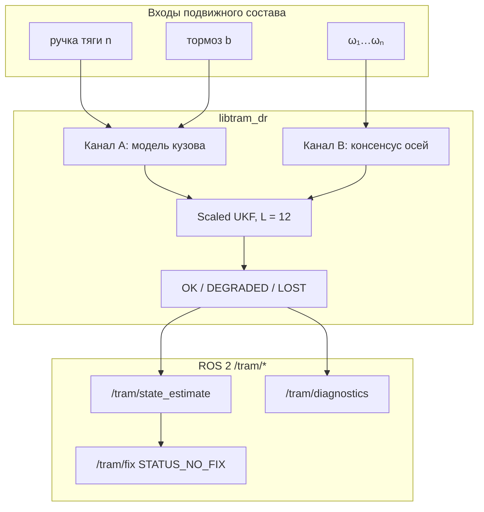

# tramDR — резервная одометрия трамвая по модели тяги и колёсным энкодерам

[](https://github.com/KonkovDV/RailBreak/actions/workflows/ci.yml)
[](LICENSE)
[](https://en.cppreference.com/w/cpp/17)
[](https://docs.ros.org/en/humble/)

Резервное счисление путевой координаты $s$ и продольной скорости $v$ трамвая
по положению контроллера, команде тормоза и угловым скоростям осей.
В контуре фильтра **нет** GNSS, ИНС, лидара и камер.

Модель кузова (канал A) не интегрирует $\omega$ — юз энкодера её не кормит.
Консенсус осей (канал B) даёт высокую частоту, пока есть сцепление.
Оба сводятся в Scaled UKF: оценка, ковариация, статус `OK / DEGRADED / LOST`.
Если сцепление сорвано на всех осях сразу, фильтр не удерживает ложную
уверенность и объявляет деградацию.

Ядро `libtram_dr` — C++17 без ROS. Пакет ROS 2 Humble: `tram_dr_localization`
(версия `tramDR-0.0.6`). Сборка и тесты ядра — из `standalone/`.

---

## Задача хакатона

* **Соревнование:** [«Хакатон Московского транспорта»](https://mt-hackathon.ru/) (2026).
* **Организаторы:** Фонд «ТИМ», ООО «МТТЕХ», ООО «ВСМ-400»; поддержка Департамента транспорта Москвы.
* **Кейс:** задача № 3 «Резервная одометрия по модели» (Приложение № 3, п. 7.2.3 Положения).
* **Права:** по п. 14.2.2 Положения исключительные права на материалы решения трека GNSS-denied позиционирования отчуждаются Фонду «ТИМ» с момента сдачи. До сдачи код — [MIT](LICENSE); заимствования — [NOTICE](NOTICE) (п. 7.6).

Это **запасной** контур, не замена штатной лидарной локализации ЦБТ.
Сертификации SIL/CENELEC нет и не заявляется.

---

## Соответствие критериям экспертной комиссии (п. 10.7)

Баллы ставит комиссия. Ниже — что именно сдаётся по каждому пункту.

| № | Критерий (п. 10.7) | Что есть в репозитории |
| :-: | :--- | :--- |
| 1 | Соответствие задаче | Модель привода F(v), пакет ROS 2, в фильтре нет подписок на GNSS/IMU/лидар/камеры (`tools/eval/no_gnss_scan.py`). `/tram/fix` — проекция пути со статусом `STATUS_NO_FIX`. |
| 2 | Работоспособность MVP | Ядро собирается без ROS; `ctest`, скрипты `tools/eval` и `tools/synth`, Docker, `replay_ukf`. CI: [ci.yml](.github/workflows/ci.yml). |
| 3 | Техническая реализуемость | На машине сборки Release-медиана шага `replay_ukf` ≈ 13 мкс (не стенд заказчика). Состояние фиксированного размера L=12. GPU не требуется. |
| 4 | Качество архитектуры | Ядро отделено от ROS. Вход: QoS `best_effort`; выход одометрии: `reliable`. Сторож 50 Гц. Чекер `check_envelope.py` не импортирует UKF. |
| 5 | Качество алгоритма | Scaled UKF, α=0.58 (Luo–Moroz), кинематический Q пары (s, v), M-оценка Хьюбера, крип по EN 15595, интегратор расхождения D. |
| 6 | Применимость для Москвы | Default launch: 71-911ЕМ «Львёнок-Москва», маршрут № 10, `sca_pair_lr=false` (оси, не IRW). Уклон моста **не** зашит в ноду: сила уходит в F<sub>bias</sub>. |
| 7 | Потенциал внедрения | Утилиты `identify_*` калибруют Дэвиса, ручку и рывок по записи. Готовность к подключению как отдельный топик — не внедрение в автопилот ЦБТ. |
| 8 | Новизна / ценность | Два принципа + явная метрика опасного отказа (HMI-rate) вместо подгона RMSE на юзе. |
| 9 | Аргументация | Границы наблюдаемости, сценарий `mismatch_r0`, открытые допущения. Полный вывод: [`docs/math.md`](docs/math.md). |
| 10 | Комплектность (п. 8.7) | Код, формулы, схема, инструкция запуска, графики [`evidence/plots-pitch/`](evidence/plots-pitch/), [`HACKATHON.md`](HACKATHON.md). |

---

## Архитектура



**Канал A** не интегрирует $\omega$, поэтому юз энкодера его не кормит.
Модель всё же ограничена кулоновским потолком: это не «абсолютная
независимость от сцепления», а независимость от показаний колёс.

**Канал B** даёт высокую частоту, пока есть сцепление. SCA инфлрует
ковариации сорванных и зависших осей, не выкидывая канал жёстко.

Если оба принципа расходятся дольше порога пути — `DEGRADED`.

---

## Физика канала A

Движение стеснено рельсом: $s$ (м), $v=\dot s$ (м/с).

Числовые коэффициенты ниже — **синтетический twin Combino NF100**
(ITSC 2020, 28 т, $r_0=0.35$ м). Это эталон e2e, не паспорт 71-911ЕМ.
У «Львёнка» тара и диаметр в YAML **не заданы** (разброс открытых источников,
не руководство по эксплуатации); клип массы $[15,40]$ т.
Launch грузит `estimator.yaml` (twin: 28 т, $r_0=0.35$ м), затем оверлей
Львёнка меняет профиль, `sca_pair_lr`, клип массы и `mass_door_kg` — но не
подставляет паспортную тару и Ø, их нет. Калибровка — `identify_*` по bag.
PT1 привода и ограничение рывка в коде есть, **по умолчанию выключены**
(`tau_drv_s=0`, `j_max_mps3=0`). Доля магниторельса у «Львёнка»: `0`.

```math
m_{\mathrm{eff}}(1+\gamma_{\mathrm{rot}})\dot{v}
= F_{\mathrm{trac}}(n,v)-F_{\mathrm{brake}}(b,v)-R_{\mathrm{run}}(v)-F_{\mathrm{bias}}
```

$F_{\mathrm{bias}}$ — **скаляр** неучтённой силы (уклон, ветер, кривая), не карта $i(s)$.
$\gamma_{\mathrm{rot}}$ в близнеце равен 0.

Тяга по умолчанию — характеристика постоянной силы до базовой скорости,
далее гипербола мощности:

```math
F_{\mathrm{trac}}^{\star}(n,v)=|n|\,k_{\mathrm{trac}}\cdot
\begin{cases}
F_{\max}, & |v|\le v_b\\
F_{\max}\,v_b/|v|, & |v|>v_b
\end{cases}
```

$F_{\max}=m_0 a_{\mathrm{trac}}^{\max}$, $v_b=6.0$ м/с (twin).
Режим `notch_as_accel` задаёт силу через целевое ускорение.

Тормоз делится на адгезионную долю и необязательную рельсовую
(`brake_nonadhesive_frac`). Контакт ограничен Кулоном
$\lvert F_{\mathrm{cmd}}-F_{\mathrm{brake,adh}}\rvert\le m_{\mathrm{eff}} g\hat\mu$.

Дэвис близнеца: $R_{\mathrm{run}}=A_d+B_d|v|+C_d v^2$
с $A_d=800$ Н, $B_d=40$ Н·с/м, $C_d=6$ Н·с²/м² — старт идентификации,
не измерение московского вагона.

Полный вывод и режим `notch_as_accel`: [`docs/math.md`](docs/math.md).

---

## Канал B и скольжение

```math
\omega_i = v/(d_i r_0),\qquad d_i\in[0.85,1.05]
```

SCA (`sca.cpp`): медиана консенсуса, $z$-score, инфляция $R_{ii}$ при
$z_i>2.5$, детектор зависания энкодера (окно 25 отсчётов).
`sca_pair_lr=true` только у twin Combino (IRW). У «Львёнка» и «Витязя»
каналы — оси, `sca_pair_lr=false`.

Относительный крип (терминология EN 15595, не сертификация WSP):

```math
\kappa=\frac{r_0\omega_{\mathrm{med}}-v}{\max(|v|,\,1.0)}
```

Пол 1.0 м/с обязателен: иначе стояночный хвост 0.14 м/с даёт ложные 100 %.
Латч: $|\kappa|>0.25$ в течение 0.2 с **и** знак согласован с тягой/тормозом.

Скрытый микроюз WSP (10–25 %, ниже порога $\kappa$) ловит интегратор
расхождения теневой модели кузова $v_A$ и колёс. На тормозе в тени
$F_{\mathrm{bias}}$ обнуляется, чтобы фильтр не «объяснял» юз уклоном.

```math
D=\int|r_0\omega_{\mathrm{med}}-v_A|\,dt
```

Переход в `DEGRADED`, если $D\ge 5+0.05\,s$ (метры). На синтетике
`snow_ice` / WSP-циклы это срабатывает; на записи организатора
порог ещё не прогонялся.

---

## Scaled UKF

Размерность **всегда** $L=6+n_{\max}=12$ (компиляторный потолок 6 осей).
На «Львёнке» живы 4 канала $d_i$; лишние не обновляются.

```math
x=\begin{bmatrix}s&v&F_{\mathrm{bias}}&m_{\mathrm{eff}}&k_{\mathrm{trac}}&d_1\ldots d_n&\hat\mu\end{bmatrix}^{\top}
```

Внутри фильтра: $\log m$, $\log k$, $\log d_i$, logit по $\mu\in[0.05,0.50]$.
$s$, $v$, $F_{\mathrm{bias}}$ — в СИ.

$\alpha=0.58$, $\beta=2$, $\kappa_{\mathrm{UT}}=0$. При $L=12$ условие Luo–Moroz
на $W_c^{(0)}\ge 0$ требует $\alpha\ge 1/\sqrt{3}\approx 0.577$. Это численный
выбор, не доказательство сходимости фильтра на реальном вагоне.

Шум пары $(s,v)$ — дискретизация белого ускорения
$q_v=0.0025$ м²/с³ (формула Ван Лоана для этой кинематики).
Отдельного фиктивного $Q_{ss}$ нет.

Коррекция по $\omega$: Huber/DCS, $c=3$.

---

## Что наблюдаемо, а что нет

Измерение оси $h_i=v/(d_i r_0)$. Отношения $d_i/d_j$ и масштаб $v/\bar d$
видны. Масса отдельно от тяги — слабо (раскрывается на гиперболе мощности
и на $C_d v^2$). Уклон отдельно от $A_d$ и $F_{\mathrm{bias}}$ — нет.
$\hat\mu$ без момента на валу — случайное блуждание с клипом, не наблюдатель
адгезии.

После **синхронного** юза всех осей координата $s$ без внешнего репера
не восстанавливается. Корректный выход — `DEGRADED`, не «дотянуть» RMSE.

Сценарий `mismatch_r0`: все $d_i=0.88$, крип между осями нулевой, статус
остаётся `OK`, HMI-rate $=0.42$. Это предел масштаба одометрии, не баг
фильтра. Парируется калибровкой $r_0$ (`identify_coast.py`), не новым UKF.
Смежный `diameter_wear`: RMSE UKF ≈ наивной одометрии — та же физика,
слабее амплитуда.

---

## Маршрут № 10

Беспилот ЦБТ: Щукинская — ул. Кулакова, вагон 71-911ЕМ, все 4 оси моторные.
Пассивной бегунковой оси нет: второй принцип — модель кузова.

Полилиния остановок OSM (`route_10.yaml`, 9 вершин). Это не ось пути и не
профиль уклона.

```
Щукинская (0 м)
  → Новощукинская / Детская поликлиника (174.7 м)
  → Бурназяна (408.4 м)
  →  [Строгинский мост ~570 м; оценка спуска 25–40 ‰, центр 32 ‰]
  → Исаковского, 33 (2794 м)
  → Катукова (3222.8) → Строгино (3711.1)
  → Цветаевой (4196) → Таллинская (4605.4) → Кулакова (4832.3 м)
```

32 ‰ **не** константа ноды. С июня 2026 на русловой части — временная линия
(mos.ru / АГН / «Метро», июнь 2026); режим на 25.09 заранее не утверждаем.

Импульс `mass_door_kg` после ZUPT разрешён только при
$|s-s_{\mathrm{stop}}|\le 40$ м, если карта остановок загружена.
Без `--route` (синтетика) импульс **не гейтится** — так задумано для e2e.
Ожидание у стрелки на мосту не должно размывать массу салона.

---

## Что измерено

Организаторский rosbag2 ещё не выдан (окно кода 25–27.09.2026).
Цифры ниже — **синтетический близнец**, seed 42, пакет
[`evidence/synth-2026-09-04/`](evidence/synth-2026-09-04/),
ядро `tramDR-0.0.6`. Канон имён и чисел:
[`docs/metrics.md`](docs/metrics.md). Графики:
[`evidence/plots-pitch/`](evidence/plots-pitch/).

HMI-rate — доля кадров со статусом `OK`, где
$|s_{\mathrm{est}}-s_{\mathrm{gt}}|>5+0.05\,s_{\mathrm{gt}}$.
На юзе RMSE большой **ожидаем**: важнее вовремя сказать `DEGRADED`.
На `slide_brake` чистая модель кузова даёт меньший RMSE, чем UKF;
UKF здесь выигрывает статусом, не метрами.

| Сценарий | Смысл | HMI-rate | Путь до первого DEGRADED |
| :--- | :--- | :---: | ---: |
| `jagged_notch` | сухой рельс, разгон / выбег / тормоз | 0 | — |
| `axle_fault` | отказ энкодера оси | 0 | — |
| `coast_no_wire` | длинный выбег | 0 | — |
| `grade_unmapped` | некартографированный уклон | 0 | — |
| `heavy_pax` | +6 т пассажиров | 0 | — |
| `tight_curve` | кривая R = 25 м (twin, `sca_pair_lr`) | 0 | — |
| `zupt_dwell` | стоянка | 0 | — |
| `wet_clean` | μ = 0.20 | 0 | — |
| `six_axle` | Витязь-М, 6 каналов | 0 | — |
| `model_mismatch` | Дэвис ×1.3, тяга ×0.7 | 0 | — |
| `mismatch_jerk` | рывок, ложный латч не должен сработать | 0 | — |
| `slide_brake` | юз при тормозе, μ = 0.06 | 0 | 1.67 м |
| `slip_accel` | пробуксовка | 0 | 0.11 м |
| `snow_ice` | ступеньки μ, циклы WSP | 0 | 0.11 м |
| `slide_on_grade` | юз + уклон 1:56 | 0 | 1.63 м |
| `mismatch_jerk_slip` | рывок + юз | 0 | 0.08 м |
| `diameter_wear` | износ, оси согласны | 0 | RMSE ≈ naive |
| `mismatch_r0` | все диаметры ×0.88 | **0.42** | остаётся `OK` |
| `coast_grade_route10` | выбег, оценка 32 ‰, 50 с | 0 | $F_{\mathrm{bias}}$ съел рампу |
| `slide_on_grade_route10` | тормоз на спуске 32 ‰ | 0 | 1.67 м |
| `slide_on_grade_route10_steep` | то же, 40 ‰ | 0 | 1.67 м |
| `grade_traction_route10` | пробуксовка на подъёме | 0 | 0.11 м |

17 из 18 сценариев близнеца — HMI-rate 0. Восемнадцатый (`mismatch_r0`)
оставлен как предел. Четыре `*route10*` — оценка профиля моста, не документ
уклона и не прогон по bag.

---

## Сборка и демонстрация

Linux (Ubuntu 22.04) или Windows; CMake ≥ 3.16; C++17; Python 3.10+.
ROS 2 Humble — только для узлов.

```bash
python tools/synth/generate.py
cmake -S standalone -B standalone/build -DCMAKE_BUILD_TYPE=Release
cmake --build standalone/build --parallel
ctest --test-dir standalone/build --output-on-failure
python tools/synth/test_generate.py
python tools/eval/test_eval.py
python tools/eval/no_gnss_scan.py
python tools/eval/run_e2e.py --ukf standalone/build/replay_ukf
python tools/synth/score.py
```

Docker (сборка пакета и `ros2 launch`, без GUI). Bag на хосте — `data/bags/run01`:

```bash
docker compose build
docker compose run --rm -e BAG=/data/bags/run01 tram_dr
```

Когда появится запись организатора:

```bash
python tools/eval/inspect_bag.py data/bags/run01 \
  --write-yaml tram_dr_localization/config/customer_topics.yaml
python tools/eval/run_bag.py data/bags/run01 \
  --ukf standalone/build/replay_ukf \
  --route tram_dr_localization/config/route_10.yaml \
  --vehicle tram_dr_localization/config/vehicle_lvenok_moscow.yaml \
  --baselines
```

`profile_from_bag.py` строит высотный профиль **оффлайн** по GT (в том числе
лидарному, если он есть в bag). Это не вход фильтра.

---

## Репозиторий

| Путь | Содержание |
| :--- | :--- |
| `tram_dr_localization/src/lib/` | `plant`, `sca`, `ukf` |
| `tram_dr_localization/src/nodes/` | оценщик, адаптер топиков, проектор, монитор |
| `tram_dr_localization/config/` | `vehicle_lvenok_moscow.yaml` (default), Combino, Витязь, `route_10.yaml` |
| `standalone/` | `replay_ukf`, `test_core` |
| `tools/eval/` | чекер, bag, `identify_*`, `no_gnss_scan.py` |
| `tools/synth/` | генератор 18+4 сценариев |
| `docs/` | модель, архитектура, метрики, питч, ссылки |
| `evidence/` | синтетический пакет и графики питча |

---

## Ссылки, которые реально стоят за кодом

1. Julier, S. J. (2002). Scaled Unscented Transformation.
2. Luo, R., Moroz, I. (2009). Positive semi-definiteness в Scaled UKF.
3. EN 15595:2018+A1:2023 — терминология relative wheel slide (не заявление о сертификации).
4. Van Loan, C. F. (1978). Интегралы с матричной экспонентой.
5. Davis, W. J. (1926). Сопротивление движению.
6. RAIB Report 08/2026: столкновение у Talerddig **21 октября 2024**, отчёт опубликован 18 июня 2026. Юз на уклоне при неисправном песке — мотив сценария `slide_on_grade`, не тождество с маршрутом 10.

Полный список: [`docs/refs.md`](docs/refs.md).

Вершины остановок — OpenStreetMap, лицензия ODbL ([NOTICE](NOTICE)).
