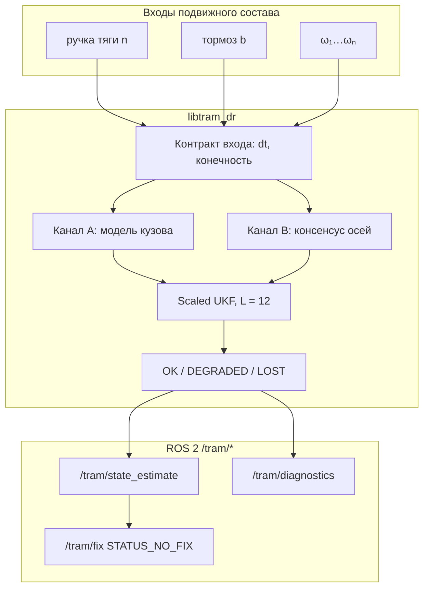

# tramDR — резервная одометрия трамвая по модели тяги и колёсным энкодерам

[](https://github.com/KonkovDV/RailBreak/actions/workflows/ci.yml)
[](LICENSE)
[](https://en.cppreference.com/w/cpp/17)
[](https://docs.ros.org/en/humble/)
[](CHANGELOG.md)

Резервное счисление путевой координаты $s$ и продольной скорости $v$ трамвая
по положению контроллера, команде тормоза и угловым скоростям осей.
В контуре фильтра **нет** GNSS, ИНС, лидара и камер.

Модель кузова (канал A) не интегрирует $\\omega$ — юз энкодера её не кормит.
Консенсус осей (канал B) даёт высокую частоту, пока есть сцепление.
Оба сводятся в Scaled UKF: оценка, ковариация, статус `OK / DEGRADED / LOST`.
Если сцепление сорвано на всех осях сразу, фильтр не удерживает ложную
уверенность и объявляет деградацию.

Ядро `libtram_dr` — C++17 без ROS. Пакет ROS 2 Humble: `tram_dr_localization`
(версия `tramDR-0.0.8`). Сборка и тесты ядра — из `standalone/`: цели
`test_core`, `test_integrity_contracts`, `test_ut_weights_psd`,
`test_ut_weights_header`, `replay_ukf`.

---

## Состояние решения на 06.09.2026

Ядро прошло **два** внешних прохода в режиме Red Team / WhiteHat.

* Первый проход — 17 находок (`F-01…F-17`), 12 закрыто.
* Второй проход ([PR #4](https://github.com/KonkovDV/RailBreak/pull/4),
  06.09.2026) перепроверил алгебру и физику независимо, закрыл `F-09`,
  `F-17`, `F-17b` и `F-20`, подтвердил, что `F-11` и `F-14` уже закрыты на
  `main`, и открыл семь новых пунктов (`A…G`). После слияния на `main`
  дописана вторая половина `F-08` (`validate_ukf` вызывает `weights_psd_ok`)
  и вызовы `project_pd` учитывают `bool`.

Если вы жюри — четыре документа стоит открыть раньше остальных:

| Документ | Что внутри |
| :--- | :--- |
| [`CHANGELOG.md`](CHANGELOG.md) | что изменилось в `tramDR-0.0.8`, каким контрактом закреплено, что осталось открытым |
| [`docs/verification.md`](docs/verification.md) | граница проверенного: что исполнялось численно, что прочитано построчно, что не запускалось вообще |
| [`docs/review/external-redteam-2026-09-06.md`](docs/review/external-redteam-2026-09-06.md) | второй внешний проход: что перепроверено численно, что исправлено, что осталось |
| [issue #3](https://github.com/KonkovDV/RailBreak/issues/3) | открытые находки с приоритетами и предложенными правками |

Формулировка «ошибок нет» здесь сознательно не используется: у резервного
контура позиционирования проверяемый предмет — не отсутствие дефектов, а
**частота опасного необнаруженного отказа** (HMI-rate: система рапортует `OK`,
а ошибка пути уже вышла за предел безопасности) плюс явный перечень того, что
осталось непроверенным. Оба списка ведутся в репозитории, а не в презентации.

**Состояние CI на этой ветке.** `python`, `cpp`, `asan` — зелёные локально.
Job `ros` гейтит merge: `continue-on-error` снят, `source setup.bash` больше
не выполняется под `set -u` (ament оставляет `AMENT_TRACE_SETUP_FILES`
незаданым). Первый лог на GitHub — следующий push. См.
[`ci.yml`](.github/workflows/ci.yml).

---

## Задача хакатона

* **Соревнование:** [«Хакатон Московского транспорта»](https://mt-hackathon.ru/) (2026).
* **Организаторы:** Фонд «ТИМ», ООО «МТТЕХ», ООО «ВСМ-400»; поддержка Департамента транспорта Москвы.
* **Кейс:** задача № 3 «Резервная одометрия по модели» (Приложение № 3, п. 7.2.3 Положения).
* **Права:** по п. 14.2.2 Положения исключительные права на материалы решения трека GNSS-denied позиционирования отчуждаются Фонду «ТИМ» с момента сдачи. До сдачи код — [MIT](LICENSE); заимствования — [NOTICE](NOTICE) (п. 7.6).
* **Публикация.** Отдельный и более острый пункт: пп. 14.4–14.6 Положения требуют **письменного согласия организаторов на саму публикацию** материалов решения, а п. 15 вводит режим конфиденциальности; нарушение — основание для дисквалификации (пп. 15.6, 17.1). Публичный репозиторий под MIT — это уже состоявшаяся публикация, и выданная лицензия **безотзывна**: перевод репозитория в private ограничивает дальнейшее распространение, но не отменяет прав, уже полученных теми, кто успел его скопировать. Согласие следует запросить письмом (`fund@ftim.ru`, `info@mttech.moscow`) **до** сдачи. Подробнее — [NOTICE](NOTICE).

Нумерация пунктов Положения взята из публичного описания задачи и
**подлежит сверке с подписанным PDF** до сдачи (см. `docs/verification.md`).

Это **запасной** контур, не замена штатной лидарной локализации ЦБТ.
Сертификации SIL/CENELEC нет и не заявляется.

---

## Соответствие критериям экспертной комиссии (п. 10.7)

Баллы ставит комиссия. Ниже — что именно сдаётся по каждому пункту.

| № | Критерий (п. 10.7) | Что есть в репозитории |
| :-: | :--- | :--- |
| 1 | Соответствие задаче | Модель привода $F(v)$, пакет ROS 2, в фильтре нет подписок на GNSS/IMU/лидар/камеры (`tools/eval/no_gnss_scan.py`). `/tram/fix` — проекция пути со статусом `STATUS_NO_FIX`. |
| 2 | Работоспособность MVP | Ядро собирается без ROS; `ctest` — **четыре** цели (`test_core`, `test_integrity_contracts`, `test_ut_weights_psd`, `test_ut_weights_header`), скрипты `tools/eval` и `tools/synth`, Docker, `replay_ukf`. CI: [ci.yml](.github/workflows/ci.yml) — `python`, `cpp` (Release + e2e), `asan` (ASan/UBSan на **всех четырёх** целях) зелёные; `ros` (colcon + четыре ament-gtest сюиты) гейтит merge, `source setup.bash` без `set -u`. |
| 3 | Техническая реализуемость | На машине этого прогона Release-медиана шага `replay_ukf` ≈ 10 мкс (не стенд заказчика). Состояние фиксированного размера $L=12$. GPU не требуется. |
| 4 | Качество архитектуры | Ядро отделено от ROS. Вход: QoS `best_effort`; выход одометрии: `reliable`. Сторож 50 Гц. Чекер `check_envelope.py` не импортирует UKF. Контракт входа проверяется в ядре, а не только в узле (защита в глубину). Шкалы времени измерений и узла разделены (`F-17b`, см. ниже). |
| 5 | Качество алгоритма | Scaled UKF, $\\alpha=0.58$: окно $W_c^{(0)}\\ge 0$ при $\\beta=2$ — $\\alpha\\in[0.5176,\\,1.9319]$, достаточное Luo–Moroz — $0.5774$. Запасы посчитаны точно: $+0.459\\,\\%$ над Luo–Moroz и $+12.047\\,\\%$ над истинной границей; совместный предикат $(\\alpha,\\beta,\\kappa)$ вынесен в `ut_weights.hpp` и закреплён двумя независимыми тестами. Кинематический $Q$ пары $(s,v)$ сверен с интегралом Ван Лоана (невязка $1.06\\cdot10^{-22}$). Huber на $S_{ii}$, крип по EN 15595, интегратор $D$. |
| 6 | Применимость для Москвы | Default launch: 71-911ЕМ «Львёнок-Москва», маршрут № 10, `sca_pair_lr=false` (оси, не IRW). Уклон моста **не** зашит в ноду: сила уходит в $F_{\\mathrm{bias}}$. |
| 7 | Потенциал внедрения | Утилиты `identify_*` калибруют Дэвиса, ручку и рывок по записи. Готовность к подключению как отдельный топик — не внедрение в автопилот ЦБТ. |
| 8 | Новизна / ценность | Два принципа + явная метрика опасного отказа (HMI-rate) вместо подгона RMSE на юзе. Худший случай PL/AL посчитан, а не оценён «на глаз» (см. ниже). |
| 9 | Аргументация | Границы наблюдаемости, сценарий `mismatch_r0`, открытые допущения. Канон: [`docs/brief.md`](docs/brief.md), вывод: [`docs/math.md`](docs/math.md). |
| 10 | Комплектность (п. 8.7) | Код, формулы, схема, инструкция запуска, графики [`evidence/plots-pitch/`](evidence/plots-pitch/), [`HACKATHON.md`](HACKATHON.md), [`docs/brief.md`](docs/brief.md), история версий [`CHANGELOG.md`](CHANGELOG.md), граница проверенного [`docs/verification.md`](docs/verification.md), внешние проходы [`docs/review/`](docs/review/). |

---

## Архитектура



**Канал A** не интегрирует $\\omega$, поэтому юз энкодера его не кормит.
Модель всё же ограничена кулоновским потолком: это не «абсолютная
независимость от сцепления», а независимость от показаний колёс.

**Канал B** даёт высокую частоту, пока есть сцепление. SCA инфлирует
ковариации сорванных и зависших осей, не выкидывая канал жёстко.

Если оба принципа расходятся дольше порога пути — `DEGRADED`.

---

## Контракты целостности ядра (0.0.8)

Шесть из них появились после триажа: до 0.0.7 фильтр мог принять чужое
свидетельство за своё или оставить в состоянии результат неудачного шага.

| Контракт | Что гарантирует | Чем закреплён |
| :--- | :--- | :--- |
| Стоянка только по свидетельству | нулевые $\\omega$ при отпущенном тормозе — **не** доказательство стоянки; заклиненные на выбеге колёса не включают ZUPT и не стирают движущийся кузов | `no zupt on sliding lock` (`test_core`), `coasting locked wheels are not ZUPT`, `false zero wheels cannot erase a moving body` (`test_integrity_contracts`) |
| Режим без самолатча | `classify` не принимает собственный предыдущий вывод (`mode_ == kStandstill`) за входное свидетельство | `test_integrity_contracts` |
| Свежесть во времени | окно залипания энкодера `freeze_s` = 0.5 с считается в секундах, а не в тактах фильтра: при переменном $\\Delta t$ окно не плывёт | `test_integrity_contracts` |
| Контракт входа | $\\Delta t$ и конечность `notch` / `brake` / $\\omega$ проверяются **до** шага | `test_integrity_contracts` |
| Атомарность шага | шаг, породивший нефинитное состояние или отказ Холецкого, откатывается целиком (`*this = previous`), счётчик `chol_fail` растёт; полусостояний в фильтре не остаётся | `test_integrity_contracts` |
| Численная гигиена | `la::chol` и `la::inv_spd` отказывают на NaN/Inf вместо «успеха»; `la::project_pd` не трогает уже положительно определённую матрицу, **возвращает признак неудачи** и отклоняет нефинитный вход (`F-09` закрыт) | численный стенд, [`docs/verification.md`](docs/verification.md) |
| Разделение шкал времени | метки измерений и часы узла — **две разные шкалы**; узел не вычитает одну из другой и не фабрикует $\\Delta t$ (`F-17`, `F-17b`) | раздел «Шкалы времени» ниже, [`docs/review/external-redteam-2026-09-06.md`](docs/review/external-redteam-2026-09-06.md) |

Что здесь честно назвать своим именем: «ковариация разрушалась» — сильное
слово, и оно не подтвердилось. Порча `project_pd` измерена:
$\\max\\lvert\\Delta P\\rvert = 0.1097$ на плотной SPD $12\\times12$ (внедиагональ
$1.4788\\to1.2444$, около $16\\,\\%$), но на реалистичной ковариации фильтра с
$\\mathrm{cond}\\approx 2\\cdot10^{10}$ это $2.39\\cdot10^{-7}$ по модулю и
$3.5\\cdot10^{-13}$ относительно по Фробениусу. После правки проектор — no-op
на PD-входе.

`F-09` закрыт в 0.0.7: раньше при нефинитном входе `project_pd` выходил
досрочно, не санируя матрицу и **не сообщая об этом** — тип возврата был
`void`, так что вызывающий не мог отличить «починил» от «сдался». Теперь
функция возвращает `bool`, проверяет конечность входа и выхода через новый
`la::all_finite`, и контракт «проектор либо починил, либо сказал, что не
смог» стал проверяемым. Вызывающая сторона в `ukf.cpp` читает `bool`
(`F-09`); при отказе шаг откатывается целиком, а не коммитит отремонтированную $P$.
Fallback в `predict()` после отказа Холецкого убран (`B`): нет шага среднего
и нет $P+=Q+\mathrm{bump}$.

Гейт стоянки больше не опирается только на $\lvert\hat v\rvert$: $\omega\equiv 0$
дольше 2 с при тихой ручке включает ZUPT даже при $\lvert\hat v\rvert\ge 0.35$
(`F-10`), с флагом `zupt_forced` и статусом `DEGRADED`. 16 тиков (0.32 с)
заклиненных колёс по-прежнему не стоянка (`F-01`).

---

## Шкалы времени и контракт узла

Это самая дорогая находка второго прохода (`F-17b`), и она не про формулы,
а про то, чем узел считает время.

В узле сходятся **две независимые шкалы**: метки времени в сообщениях
(`header.stamp`, шкала источника — bag, симулятор или бортовая сеть) и часы
самого узла (`now()`). Прежний код держал один якорь и вычитал одну шкалу из
другой. На записи, проигранной **без** `use_sim_time:=true`, расхождение
составляет часы или годы — и вот что с ним делал `std::clamp(dt, 0.005,
0.20)`: превращал и абсурдно большой, и абсурдно малый интервал в
правдоподобные 200 мс и 5 мс. То есть клип не защищал фильтр, а **уничтожал
улику** и одновременно выводил из строя оба сторожа свежести — они сравнивали
величины из разных шкал и потому не срабатывали никогда.

Теперь шкалы разделены: измерения датируются своей шкалой, шаг фильтра —
своей, перекос между ними **измеряется и публикуется**, а не поглощается
клипом. Семь новых параметров узла:

| Параметр | По умолчанию | Смысл |
| :--- | ---: | :--- |
| `notch_stale_s` | 0.25 с | после этого ручка недействительна |
| `default_dt_s` | 0.02 с | шаг, когда своей метки ещё нет |
| `dt_min_s` | 0.001 с | ниже — интервал не физичен |
| `dt_max_s` | 0.20 с | выше — разрыв, а не шаг |
| `stamp_regression_tol_s` | 0.001 с | допуск на непорядок меток |
| `stamp_skew_warn_s` | 5.0 с | порог предупреждения о перекосе шкал |
| `max_catchup_steps` | 100 | потолок догоняющих шагов после разрыва |

И тринадцать новых ключей в `/tram/diagnostics`, чтобы перекос было видно
снаружи, а не только в падении точности: `timebase`, `stamp_skew_s`,
`stamp_skew_events`, `dt_s`, `stamp_regressions`, `dt_gaps`, `dt_floored`,
`catchup_steps`, `bad_notch`, `bad_brake`, `bad_wheels`,
`n_omega_nonfinite`, `input_fault`.

> **Практическое следствие для демонстрации.** Проигрывая rosbag2, запускайте
> узел с `use_sim_time:=true`. Без этого `stamp_skew_s` покажет разрыв шкал —
> и это правильное поведение, а не поломка: раньше та же ситуация молча
> давала «нормальный» $\\Delta t$ и тихо испорченную оценку.

Оговорка о границе проверенного: узлы ROS в CI **не собираются** (`F-19`
открыт, job `ros` не проходит), поэтому этот слой проверен чтением и
контрактами ядра, но не исполнением в конвейере.

---

## Физика канала A

Движение стеснено рельсом: $s$ (м), $v=\\dot s$ (м/с).

Числовые коэффициенты ниже — **синтетический twin Combino NF100**
(ITSC 2020, 28 т, $r_0=0.35$ м). Это эталон e2e, не паспорт 71-911ЕМ.
У «Львёнка» тара и диаметр в YAML **не заданы** (разброс открытых источников,
не руководство по эксплуатации); клип массы $[15,40]$ т.
Launch грузит `estimator.yaml` (twin: 28 т, $r_0=0.35$ м), затем оверлей
Львёнка меняет профиль, `sca_pair_lr`, клип массы, `mass_door_kg` и
`r0_uncalibrated: true` — статус пути `DEGRADED`, пока `identify_coast.py`
не запишет Ø. Паспортную тару и Ø оверлей **не** подставляет, их нет.
PT1 привода и ограничение рывка в коде есть, **по умолчанию выключены**
(`tau_drv_s=0`, `j_max_mps3=0`). Доля магниторельса у «Львёнка»: `0`.

$$
m_{\\mathrm{eff}}(1+\\gamma_{\\mathrm{rot}})\\dot{v}
= F_{\\mathrm{trac}}(n,v)-F_{\\mathrm{brake}}(b,v)-R_{\\mathrm{run}}(v)-F_{\\mathrm{bias}}
$$

$F_{\\mathrm{bias}}$ — **скаляр** неучтённой силы (уклон, ветер, кривая), не карта $i(s)$.
$\\gamma_{\\mathrm{rot}}$ в близнеце равен 0.

Тяга по умолчанию — характеристика постоянной силы до базовой скорости,
далее гипербола мощности:

$$
F_{\\mathrm{trac}}(n,v)=k_{\\mathrm{trac}}\\,n\\cdot
\\begin{cases}
F_{\\max}, & \\lvert v\\rvert\\le v_b\\\\
F_{\\max}\\,v_b/\\max(\\lvert v\\rvert,v_b), & \\lvert v\\rvert>v_b
\\end{cases}
$$

$F_{\\max}=m_0 a_{\\mathrm{trac}}^{\\max}$, $v_b=6.0$ м/с (twin).
$n\\in[-1,1]$ после `map_notch` (знак сохраняется).
Режим `notch_as_accel` задаёт силу через целевое ускорение.

Тормоз делится на адгезионную долю и необязательную рельсовую
(`brake_nonadhesive_frac`). Контакт ограничен Кулоном
$\\lvert F_{\\mathrm{cmd}}-F_{\\mathrm{brake,adh}}\\rvert\\le m_{\\mathrm{eff}} g\\hat\\mu$.
Поэтому служебное $a_{\\mathrm{svc}}=1.2$ м/с² требует $\\hat\\mu\\ge 0.1223$: на
загрязнённой плёнке ($\\mu=0.06$) потолок адгезии равен $0.589$ м/с², и
команда служебного торможения физически недостижима. Сценарии юза — это
корректная работа модели, а не её поломка.

Дэвис близнеца: $R_{\\mathrm{run}}=\\operatorname{sgn}(v)\\,(A_d+B_d\\lvert v\\rvert+C_d v^2)$,
ноль при $\\lvert v\\rvert<v_\\varepsilon$. Старт $A_d=800$ Н, $B_d=40$ Н·с/м,
$C_d=6$ Н·с²/м² — идентификация, не измерение московского вагона.
Мёртвая зона разрывна по построению: $v=0.09$ м/с даёт $0$ Н, $v=0.11$ м/с —
$804.5$ Н, то есть скачок $0.029$ м/с² при 28 т. На стоянке зоной владеет
ZUPT, поэтому в метриках разрыв не виден; при ползучем движении
$0.05\\ldots0.15$ м/с он существует, и здесь он назван явно, а не спрятан.

Наблюдаемость, целостность и словарь доклада: [`docs/brief.md`](docs/brief.md).
Полный вывод и режим `notch_as_accel`: [`docs/math.md`](docs/math.md).

---

## Канал B и скольжение

$$
\\omega_i = v/(d_i r_0),\\qquad d_i\\in[0.85,1.05]
$$

SCA (`sca.cpp`): медиана консенсуса, $z$-score, инфляция $R_{ii}$ при
$z_i>2.5$, детектор зависания энкодера (окно `freeze_s` = 0.5 с **во
времени**, не в тактах).
Нефинитные $\\omega$ и полный обрыв всех каналов: оси inflated, статус `LOST`.
Ручка, пропавшая после первого кадра, через 0.25 с считается недействительной
(ядро: `LOST` через 2 с).
`sca_pair_lr=true` только у twin Combino (IRW). У «Львёнка» и «Витязя»
каналы — оси, `sca_pair_lr=false`.

Относительный крип (терминология EN 15595, не сертификация WSP):

$$
\\kappa=\\frac{v_{\\mathrm{wh}}-v}{\\max(\\lvert v\\rvert,\\,1.0)},\\qquad
v_{\\mathrm{wh}}=\\mathrm{median}(d_i r_0\\omega_i)
$$

Пол 1.0 м/с обязателен: расхождение 0.5 м/с при $v=0.14$ м/с даёт с полом
$\\kappa=0.5$, а без пола $\\kappa=3.57$ — латч срабатывал бы на каждой
остановке. Ниже пола владеет ZUPT; ортогональное свидетельство покоя —
$\\omega\\equiv 0$ дольше 2 с (`F-10`).
Латч: $\\lvert\\kappa\\rvert>0.25$ в течение 0.2 с **и** знак согласован с тягой/тормозом.

Скрытый микроюз WSP (10–25 %, ниже порога $\\kappa$) ловит интегратор
расхождения теневой модели кузова $v_A$ и колёс. На тормозе в тени
$F_{\\mathrm{bias}}$ обнуляется, чтобы фильтр не «объяснял» юз уклоном.

$$
D=\\int \\lvert v_{\\mathrm{wh}}-v_A\\rvert\\,dt
$$

(на тяге только $v_{\\mathrm{wh}}>v_A$; пол $\\max(0.45,\\,0.04\\max(\\lvert v_A\\rvert,1))$ м/с;
иначе спад $\\tau=60$ с).

Переход в `DEGRADED`, если $D\\ge AL_s$, где у фильтра
$AL_s=5+0.05\\max(\\hat s,0)$ м. На синтетике
`snow_ice` / WSP-циклы это срабатывает; на записи организатора
порог ещё не прогонялся.

---

## Scaled UKF

Размерность **всегда** $L=6+n_{\\max}=12$ (компиляторный потолок 6 осей).
На «Львёнке» живы 4 канала $d_i$; лишние не обновляются.

$$
x=\\begin{bmatrix}s&v&F_{\\mathrm{bias}}&m_{\\mathrm{eff}}&k_{\\mathrm{trac}}&d_1\\ldots d_n&\\hat\\mu\\end{bmatrix}^{\\top}
$$

Внутри фильтра: $\\log m$, $\\log k$, $\\log d_i$, logit по $\\mu\\in[0.05,0.50]$.
$s$, $v$, $F_{\\mathrm{bias}}$ — в СИ.

$\\alpha=0.58$, $\\beta=2$, $\\kappa_{\\mathrm{UT}}=0$. Два разных условия, оба
выполнены: $W_c^{(0)}\\ge 0$ требует $\\alpha\\ge\\sqrt{2-\\sqrt{3}}\\approx 0.5176$;
достаточное Luo–Moroz (PSD) — $\\alpha\\ge 1/\\sqrt{1+\\beta}\\approx 0.5774$. При
$L=12$, $\\beta=2$, $\\kappa_{\\mathrm{UT}}=0$ веса равны
$\\lambda=-7.9632$, $W_m^{(0)}=-1.972652$, $W_c^{(0)}=+0.690948$,
$W_i=0.123860$, $\\sum W_m=1$, $\\sum W_c=3.6636$ (последнее — свойство scaled
UT, а не ошибка нормировки).

Окно допустимых $\\alpha$ **не зависит от $L$**: при $\\beta=2$ это
$[0.5176,\\,1.9319]$, при $\\beta=1$ — $[0.6180,\\,1.6180]$ (это ровно
$1/\\varphi$ и $\\varphi$), при $\\beta=0$ — ровно $\\{1\\}$. Причина
L-независимости в том, что при $\\kappa_{\\mathrm{UT}}=0$ выполняется
$W_m^{(0)}=1-1/\\alpha^2$, и $L$ сокращается; тогда
$W_c^{(0)}=2+\\beta-\\alpha^2-1/\\alpha^2$.

Запасы выбранного $\\alpha=0.58$ посчитаны точно, а не округлённо:

| Граница | Значение | Запас $\\alpha=0.58$ |
| :--- | ---: | ---: |
| достаточная Luo–Moroz, $1/\\sqrt3$ | $0.5773502691896258$ | $+0.459\\,\\%$ |
| истинная нижняя, $\\sqrt{2-\\sqrt3}$ | $0.5176380902050415$ | $+12.047\\,\\%$ |

Границы окна при $\\beta=2$ — **взаимно обратные**:
$\\sqrt{2-\\sqrt3}\\cdot\\sqrt{2+\\sqrt3}=\\sqrt{4-3}=1$. Поэтому второй запас
равен в точности $0.58\\sqrt{2+\\sqrt3}-1=0.1204739584953\\ldots$ Тождество
проверяется тестом **раньше** десятичного литерала — именно потому, что
один раз опечатка в этом литерале уже уронила CI этой ветки, и отличить
«неверное число» от «неверного окна» без такой проверки было нельзя.

Практический вывод: **менять $\\beta$ без пересчёта $\\alpha$ нельзя.**
Штатное $\\alpha=0.58$ допустимо при $\\beta=2$, но при $\\beta=1$ и $\\beta=0$
оно даёт $W_c^{(0)}=-0.3091$ и $-1.3091$ — то есть отрицательный вес, при
этом каждый параметр по отдельности остаётся внутри своего документированного
диапазона. Это и есть смысл `F-08`. Совместный предикат теперь вынесен в
[`ut_weights.hpp`](tram_dr_localization/include/tram_dr_localization/ut_weights.hpp)
(`weights_psd_ok`, `alpha_window`, `sufficient_alpha_lower`) и закреплён
**двумя независимыми тестами**: `test_ut_weights_psd.cpp` не включает ни один
заголовок репозитория и выводит окно с нуля (25 проверок), а
`test_ut_weights_header.cpp` сверяет с ним поставляемый заголовок, включая
сетку из 28 000 точек. Одну и ту же ошибку в алгебре нужно совершить дважды и
в двух разных формах, чтобы она прошла CI.

`validate_ukf` вызывает тот же предикат: комбинация $\alpha=0.58$ с $\beta=1$
или $\beta=0$ отвергается при конструкторе и при `set_params`. Режим cubature
окно scaled UT не использует (`F-08` закрыт целиком).

Шум пары $(s,v)$ — дискретизация белого ускорения $q_v=0.0025$ м²/с³:

$$
Q_{ss}=q_v\\Delta t^3/3,\\quad
Q_{sv}=q_v\\Delta t^2/2,\\quad
Q_{vv}=q_v\\Delta t.
$$

Отдельного фиктивного диагонального $q_s$ нет. Формулы сверены с интегралом
Ван Лоана через матричную экспоненту: невязка $1.06\\cdot10^{-22}$ при
$\\Delta t=0.02$ с — согласие на уровне машинной точности.

Коррекция по $\\omega$: Huber/DCS масштабирует диагональ инновационной
ковариации (уже с $R$), $c=3$:

$$
S_{ii}\\leftarrow S_{ii}\\max\\bigl(1,\\nu_i^2/(c^2 S_{ii})\\bigr).
$$

Protection level: $PL_s=k_{\\mathrm{over}}\\sqrt{P_{ss}}+b_s$, $k_{\\mathrm{over}}=2.5$,
$b_s=\\kappa_{\\mathrm{cut}}\\lvert v\\rvert T_d$ до latch. Фильтр сравнивает с
$AL_s=5+0.05\\max(\\hat s,0)$; чекер HMI — с $5+0.05\\lvert s_{\\mathrm{gt}}\\rvert$.

При отказе разложения Холецкого шаг **не** «доклеивается» бампом ковариации:
состояние и $P$ возвращаются к снимку начала шага, растёт `chol_fail`.
Это и есть атомарность из таблицы контрактов.

---

## Худший случай: 2385.6 м без репера

Самая жёсткая проверка замысла — не RMSE на юзе, а вопрос: **дотягивает ли
заявленный предел защиты до самого длинного участка маршрута без
внешнего репера?** На маршруте № 10 это перегон Бурназяна → Исаковского,
$2385.6$ м. При $v_{\\max}=16.7$ м/с он проходится за $142.85$ с.

Чистое счисление на кинематическом шуме $q_v=0.0025$ м²/с³ даёт
$\\sigma_s=\\sqrt{q_v t^3/3}=49.29$ м, отсюда

$$
PL_s = 2.5\\cdot 49.29 + 0.835 = 124.05\\ \\text{м},\\qquad
AL_s = 5 + 0.05\\cdot 2385.6 = 124.28\\ \\text{м}.
$$

Запас по уровню — **0.23 м, то есть 0.18 % от $AL$**. $PL_s$ пересекает $AL_s$
на $143.35$ с $\\Rightarrow$ $2393.9$ м: запас по длине — **8.3 м (0.35 %
перегона)**. Это два разных числа; округлять оба в одно «0.3 %» нельзя.

Что из этого следует, и это стоит сказать прямо:

1. Совпадение $q_v$, $k_{\\mathrm{over}}$ и наклона $AL_s$ **не случайно по
   последствиям, но случайно по происхождению** — ни один из трёх параметров
   не выбирался из этого условия. Сейчас маршрут № 10 проходит по границе.
2. Любое увеличение $q_v$, любое удлинение перегона и любое снижение
   $v_{\\max}$ (время растёт как $t$, а $\\sigma_s$ как $t^{3/2}$) выводят
   худший случай за предел. Это **связывающее проектное ограничение**, и его
   надо проверять при каждой смене маршрута или профиля шума, а не считать
   свойством решения.
3. Оценка консервативна в обе стороны: она игнорирует и коррекции по колёсам
   (в номинале ошибка определяется масштабом, $1\\,\\%$ по диаметру даёт
   $23.9$ м на этом перегоне — вчетверо внутри $AL$), и то, что при
   синхронном юзе всех осей статус обязан уйти в `DEGRADED`, а не тянуть
   RMSE. Fail-safe остаётся условным: он работает, **если** `LOST`
   объявляется вовремя.

Числа посчитаны, а не оценены; воспроизводятся из значений
`estimator.yaml` и `route_10.yaml`.

---

## Что наблюдаемо, а что нет

Измерение оси $h_i=v/(d_i r_0)$. Отношения $d_i/d_j$ и масштаб $v/\\bar d$
видны. Масса отдельно от тяги — слабо (раскрывается на гиперболе мощности
и на $C_d v^2$). Уклон отдельно от $A_d$ и $F_{\\mathrm{bias}}$ — нет.
$\\hat\\mu$ без момента на валу — случайное блуждание с клипом, не наблюдатель
адгезии.

После **синхронного** юза всех осей координата $s$ без внешнего репера
не восстанавливается. Корректный выход — `DEGRADED`, не «дотянуть» RMSE.

Сценарий `mismatch_r0`: все $d_i=0.88$, крип между осями нулевой, статус
остаётся `OK`, HMI-rate $=0.515$ при действующем поле контакта $d\\ge 0.85$.
Это предел масштаба одометрии, не баг фильтра. Парируется калибровкой $r_0$
(`identify_coast.py`), не новым UKF.
Смежный `diameter_wear`: RMSE UKF ≈ наивной одометрии — та же физика,
слабее амплитуда.

---

## Маршрут № 10

Беспилот ЦБТ: Щукинская — ул. Кулакова, вагон 71-911ЕМ, все 4 оси моторные.
Пассивной бегунковой оси нет: второй принцип — модель кузова.

Полилиния остановок OSM (`route_10.yaml`, 9 вершин). Это не ось пути и не
профиль уклона.

```
Щукинская (0 м)
  → Новощукинская / Детская поликлиника (174.7 м)
  → Бурназяна (408.4 м)
  →  [Строгинский мост ~570 м; оценка спуска 25–40 ‰, центр 32 ‰]
  → Исаковского, 33 (2794 м)      ← перегон 2385.6 м, худший случай PL/AL
  → Катукова (3222.8) → Строгино (3711.1)
  → Цветаевой (4196) → Таллинская (4605.4) → Кулакова (4832.3 м)
```

32 ‰ **не** константа ноды. С июня 2026 на русловой части — временная линия
(mos.ru / АГН / «Метро», июнь 2026); режим на 25.09 заранее не утверждаем.
Оценка вклада уклона: $g\\lvert i\\rvert$ даёт $0.245$ / $0.314$ / $0.392$ м/с²
для 25 / 32 / 40 ‰, то есть $5.4\\ldots8.6$ кН при 22 т. Режимный
$q_{\\mathrm{fb}}=3000$ Н/$\\sqrt{\\mathrm{s}}$ набирает такую полосу за
$\\approx 3\\ldots8$ с — поэтому `coast_grade_route10` остаётся `OK`, а не
потому, что уклон «учтён».

Импульс `mass_door_kg` после ZUPT разрешён только при
$\\lvert s-s_{\\mathrm{stop}}\\rvert\\le 40$ м, если карта остановок загружена.
Без `--route` (синтетика) импульс **не гейтится** — так задумано для e2e.
Ожидание у стрелки на мосту не должно размывать массу салона.

---

## Что измерено

Организаторский rosbag2 ещё не выдан (окно кода 25–27.09.2026).
Цифры ниже — **синтетический близнец**, seed 42, ядро `tramDR-0.0.8`. Канон:
[`docs/metrics.md`](docs/metrics.md). Архив 0.0.6:
[`evidence/synth-2026-09-04/`](evidence/synth-2026-09-04/). Графики:
[`evidence/plots-pitch/`](evidence/plots-pitch/) могут отставать на один пакет.

HMI-rate — доля кадров со статусом `OK`, где
$\\lvert s_{\\mathrm{est}}-s_{\\mathrm{gt}}\\rvert>5+0.05\\,\\lvert s_{\\mathrm{gt}}\\rvert$
(чекер vs GT; у фильтра $AL_s=5+0.05\\max(\\hat s,0)$).
На юзе RMSE большой **ожидаем**: важнее вовремя сказать `DEGRADED`.
На `slide_brake` чистая модель кузова даёт меньший RMSE, чем UKF;
UKF здесь выигрывает статусом, не метрами.

| Сценарий | Смысл | HMI-rate | Путь до первого DEGRADED |
| :--- | :--- | :---: | ---: |
| `jagged_notch` | сухой рельс, разгон / выбег / тормоз | 0 | — |
| `axle_fault` | отказ энкодера оси | 0 | — |
| `coast_no_wire` | длинный выбег | 0 | — |
| `grade_unmapped` | некартографированный уклон | 0 | — |
| `heavy_pax` | +12 т пассажиров (twin 28+12) | 0 | — |
| `tight_curve` | кривая R = 25 м (twin, `sca_pair_lr`) | 0 | — |
| `zupt_dwell` | стоянка | 0 | — |
| `wet_clean` | μ = 0.20 | 0 | — |
| `six_axle` | Витязь-М, 6 каналов | 0 | — |
| `model_mismatch` | Дэвис ×1.3, тяга ×0.7 | 0 | — |
| `mismatch_jerk` | рывок, ложный латч не должен сработать | 0 | — |
| `slide_brake` | юз при тормозе, μ = 0.06 | 0 | 1.98 м |
| `slip_accel` | пробуксовка | 0 | 0.11 м |
| `snow_ice` | ступеньки μ, циклы WSP | 0 | 0.11 м |
| `slide_on_grade` | юз + уклон 1:56 | 0 | 2.09 м |
| `mismatch_jerk_slip` | рывок + юз | 0 | 0.07 м |
| `diameter_wear` | износ, оси согласны | 0 | RMSE ≈ naive |
| `mismatch_r0` | все диаметры ×0.88 | **0.515** | остаётся `OK` |
| `all_encoders_dead` | NaN на всех $\\omega$ после 8 с | 0 | LOST в ядре |
| `coast_grade_route10` | выбег, оценка 32 ‰, 50 с | 0 | $F_{\\mathrm{bias}}$ съел рампу |
| `slide_on_grade_route10` | тормоз на спуске 32 ‰ | 0 | 1.98 м |
| `slide_on_grade_route10_steep` | то же, 40 ‰ | 0 | 1.98 м |
| `grade_traction_route10` | пробуксовка на подъёме | 0 | 0.11 м |

**22 из 23** сценариев в таблице — HMI-rate 0. Двадцать третий
(`mismatch_r0`) оставлен как предел наблюдаемости. Канонное число для него —
**0.515**, при действующем поле контакта $d\\ge 0.85$; **0.42** — архивное
значение пакета `evidence/synth-2026-09-04`, снятое когда генератор клипал
$d$ к 0.90 (ошибка пути 11.1 %). Ранее эти два числа стояли в документации
рядом без пометок — расхождение закрыто (`F-14`).
`all_encoders_dead` — гейт обрыва ω (не в пакете plots-pitch). Четыре
`*route10*` — оценка профиля моста. Прежняя формулировка «17 из 18»
недосчитывала собственную таблицу и исправлена.

---

## Сборка и демонстрация

Linux (Ubuntu 22.04) или Windows; CMake ≥ 3.16; C++17; Python 3.10+.
ROS 2 Humble — только для узлов.

```bash
python tools/synth/generate.py
cmake -S standalone -B standalone/build -DCMAKE_BUILD_TYPE=Release
cmake --build standalone/build --parallel
ctest --test-dir standalone/build --output-on-failure
python tools/synth/test_generate.py
python tools/eval/test_eval.py
python tools/eval/no_gnss_scan.py
python tools/eval/run_e2e.py --ukf standalone/build/replay_ukf
python tools/synth/score.py
```

`ctest` гоняет **четыре** цели:

| Цель | Что проверяет |
| :--- | :--- |
| `test_core` | поведение фильтра |
| `test_integrity_contracts` | 15 контрактов целостности |
| `test_ut_weights_psd` | 25 проверок алгебры Scaled UT; собирается **без ядра и без его заголовков** |
| `test_ut_weights_header` | сверка поставляемого `ut_weights.hpp` с той же алгеброй, сетка 28 000 точек |

Последние две — независимые половины одной проверки: первая выводит окно
$\\alpha$ с нуля, вторая сверяет с ним заголовок, который реально включается в
сборку.

Те же четыре цели под санитайзерами — как в CI-job `asan`:

```bash
cmake -S standalone -B standalone/build-asan -DCMAKE_BUILD_TYPE=Debug \
  -DCMAKE_CXX_FLAGS="-fsanitize=address,undefined -fno-omit-frame-pointer"
cmake --build standalone/build-asan \
  --target test_core test_integrity_contracts test_ut_weights_psd \
           test_ut_weights_header --parallel
ASAN_OPTIONS=detect_leaks=1 UBSAN_OPTIONS=halt_on_error=1 \
  ./standalone/build-asan/test_integrity_contracts
```

Сборка пакета ROS 2 и четыре сюиты `ament_add_gtest` в CI **пока не
проходят** (job `ros`, `F-19` открыт). Локально:

```bash
mkdir -p /ws/src && cp -a tram_dr_localization /ws/src/
cd /ws && colcon build --packages-select tram_dr_localization
colcon test --packages-select tram_dr_localization && colcon test-result --all
```

Docker (сборка пакета и `ros2 launch`, без GUI). Bag на хосте — `data/bags/run01`:

```bash
docker compose build
docker compose run --rm -e BAG=/data/bags/run01 tram_dr
```

Когда появится запись организатора:

```bash
python tools/eval/inspect_bag.py data/bags/run01 \
  --write-yaml tram_dr_localization/config/customer_topics.yaml
python tools/eval/run_bag.py data/bags/run01 \
  --ukf standalone/build/replay_ukf \
  --route tram_dr_localization/config/route_10.yaml \
  --vehicle tram_dr_localization/config/vehicle_lvenok_moscow.yaml \
  --baselines
```

> Проигрывая запись **узлами ROS**, добавляйте `use_sim_time:=true` — иначе
> шкала меток и шкала часов узла разойдутся, и `stamp_skew_s` в
> `/tram/diagnostics` это покажет (см. «Шкалы времени»).

`profile_from_bag.py` строит высотный профиль **оффлайн** по GT (в том числе
лидарному, если он есть в bag). Это не вход фильтра.

---

## Репозиторий

| Путь | Содержание |
| :--- | :--- |
| `tram_dr_localization/src/lib/` | `plant`, `sca`, `ukf`, `modes`, `map` |
| `tram_dr_localization/src/nodes/` | оценщик, адаптер топиков, проектор, монитор |
| `tram_dr_localization/include/` | `lin_alg.hpp`, `ut_weights.hpp`, `plant.hpp`, `sca.hpp`, `ukf.hpp`, `types.hpp`, … |
| `tram_dr_localization/config/` | `vehicle_lvenok_moscow.yaml` (default), Combino, Витязь, `route_10.yaml` |
| `standalone/` | `replay_ukf`, `test_core`, `test_integrity_contracts`, `test_ut_weights_psd`, `test_ut_weights_header` |
| `tools/eval/` | чекер, bag, `identify_*`, `no_gnss_scan.py` |
| `tools/synth/` | генератор 19+4 сценариев |
| `docs/` | канон [`brief.md`](docs/brief.md), модель, архитектура, метрики, питч, ссылки, [`verification.md`](docs/verification.md), [`review/`](docs/review/), [`audit-2026-09-06.md`](docs/audit-2026-09-06.md) |
| `evidence/` | синтетический пакет и графики питча |
| `CHANGELOG.md` | история версий ядра: изменение → чем проверено → что открыто |
| `NOTICE` | заимствования, лицензии и **режим публикации по Положению** |

---

## Ссылки, которые реально стоят за кодом

1. Julier, S. J. (2002). Scaled Unscented Transformation.
2. Luo, R., Moroz, I. (2009). Positive semi-definiteness в Scaled UKF.
3. EN 15595:2018+A1:2023 — терминология relative wheel slide (не заявление о сертификации).
4. Van Loan, C. F. (1978). Интегралы с матричной экспонентой — дискретизация $Q$ пары $(s,v)$; невязка кода $1.06\\cdot10^{-22}$.
5. Higham, N. J. (1988). Ближайшая симметричная положительно определённая матрица — мотив `project_pd` (Якоби + клип спектра, не SR-UKF).
6. Davis, W. J. (1926). Сопротивление движению.
7. RAIB Report 08/2026: столкновение у Talerddig **21 октября 2024**, отчёт опубликован 18 июня 2026. Юз на уклоне при неисправном песке — мотив сценария `slide_on_grade`, не тождество с маршрутом 10.

Канон (физика, наблюдаемость, целостность, литература): [`docs/brief.md`](docs/brief.md).
Полный список ссылок: [`docs/refs.md`](docs/refs.md).

Вершины остановок — OpenStreetMap, лицензия ODbL ([NOTICE](NOTICE)).
