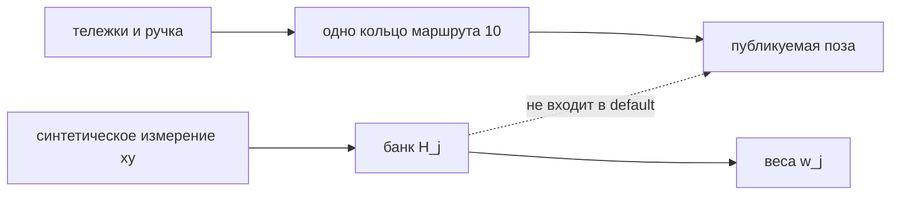

# Банк путевых гипотез

В MVP топология фиксирована кольцом, потому что выданные данные относятся к маршруту 10. Следующий слой — банк путевых гипотез для стрелок и депо. Ядро состояния при этом не меняется.

Default-фильтр по-прежнему один: x_state=[s,v,k,bₐ] на одном кольце. Банк в ноду не подключён и записи маршрута 10 не читает.

## Схема

На стрелке, общей конечной и соседнем пути одной координаты s мало: одна и та же точка на плоскости лежит на двух ветках. Гипотеза

Hⱼ = (branchⱼ, sⱼ, vⱼ, wⱼ).

После прогноза sⱼ ← sⱼ + vⱼ dt вес обновляется невязкой точки ветки к измерению:

wⱼ ∝ wⱼ⁻ exp(−1/2 rⱼᵀ Sⱼ⁻¹ rⱼ),

затем веса нормируются на единицу. В прототипе rⱼ — плоский остаток, S = (2 м)² I. Это ворота синтетической стрелки, не калибровка трамвая. k и bₐ прототип не несёт: он проверяет только вес. Когда слой встанет рядом с фильтром, внутри каждой ветки останется то же ядро [s,v,k,bₐ].

Код: `tools/organizer/path_hypotheses.py`. Он не импортирует `odometer.py` и не входит в `backup_odometry_node`.

## Синтетическая стрелка

Две ломаные совпадают первые 40 м, затем боковая уходит на 20°. Истина идёт по прямой со скоростью 10 м/с. Старт w=1/2, 1/2. Шум в измерение не добавлен.

| t, с | s, м | вес прямой | вес боковой | остаток боковой, м |
| ---: | ---: | ---: | ---: | ---: |
| 0 | 0 | 0.500 | 0.500 | 0 |
| 4.0 | 40 | 0.500 | 0.500 | 0 |
| 4.5 | 45 | 0.593 | 0.407 | 1.736 |
| 5.0 | 50 | 0.868 | 0.132 | 3.473 |
| 5.5 | 55 | 0.995 | 0.005 | 5.209 |
| 8.0 | 80 | 1.000 | 0.000 | 13.892 |

Пока измерение лежит на общем стволе, ветку выбрать нельзя. Через 1.5 с после развилки вес боковой гипотезы падает ниже 0.01. Рисунок: [fork_demo.svg](fork_demo.svg). Ряд: [fork_demo.json](fork_demo.json). Слайд: [hypothesis_roadmap.pptx](hypothesis_roadmap.pptx).
