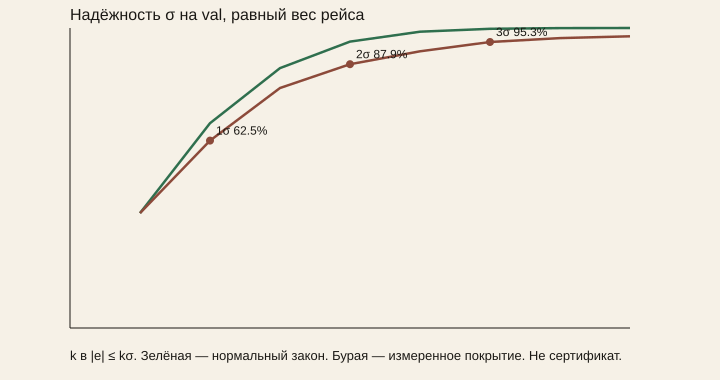

# Эмпирическая неопределённость

Таблицы и рисунок ниже — проход архива `6af0037`: 21 рейс, 198 505 фиксов RTK, доли 0.625 / 0.879 / 0.953. Текущее дерево `5cd35fa` пересчитано отдельно: 197 479 фиксов, среднее по рейсам 0.626 / 0.880 / 0.953, слитно 0.619 / 0.866 / 0.947, медиана по рейсам 0.750 / 0.943 / 0.996. c₀.₉₅ при равном весе рейсов 2.94; по вагонам 2.81 (`30618`) и 13.1 (`30639`). На `30639_0be558e2` внутри 3σ 0.489 фиксов, медиана |eₛ|/σₛ = 12.5. Эти доли стоят в [results.md](results.md) и [model.md](model.md) и с таблицами архива не смешиваются.

Pₛₛ — внутренняя шкала фильтра, не доказанная вероятность. EKF для архивного прохода не менялся. Скрытый test не читался. Отсчёты не резались случайным split: вес рейса равен 1, затем то же считается отдельно по вагонам `30618` и `30639`.

Это не сертификат и не граница целостности из [integrity.md](integrity.md). Там другой квантиль, другой сплит и другой статус.

## Диаграмма надёжности

Для каждого фиксa

zᵢ = (|e_(s,i)|)/(σ_(s,i)).

Покрытие — доля фиксов с |eₛ| ≤ kσₛ, затем среднее по рейсам. У нормального закона P(|Z| ≤ k) = erf(k/√2).

| k | равный вес рейса | все фиксы слитно | нормальный закон |
| ---: | ---: | ---: | ---: |
| 1 | 62.5 % | 61.9 % | 68.3 % |
| 2 | 87.9 % | 86.6 % | 95.4 % |
| 3 | 95.3 % | 94.8 % | 99.7 % |

Точные значения erf: 0.682689 / 0.954500 / 0.997300. Опубликованные доли 0.625 / 0.879 / 0.953 этот проход повторяет. Фактическое покрытие хуже нормального, сильнее всего в хвосте. Медиана по рейсам (0.749 / 0.946 / 0.997) ближе к закону только потому, что половина рейсов укладывается. На `30639_0be558e2` внутри 3σ остаётся 0.497 фиксов, медиана |eₛ|/σₛ = 12.6.

## Множитель

На validation, ε = 0.001 м. Ни один из 198505 σₛ ниже этого пола.

c_0.95 = Q_0.95((|eₛ|)/(max(σₛ,ε))),      B₉₅ = c_0.95 σₛ.

Квантиль взвешен: каждый рейс имеет массу 1, длинный рейс не задаёт хвост.

| объект | рейсов | фиксов | c_0.95 |
| --- | ---: | ---: | ---: |
| все val, равный вес рейса | 21 | 198505 | 2.944544 |
| вагон `30618` | 13 | 131480 | 2.815663 |
| вагон `30639` | 8 | 67025 | 13.085515 |

Для одной формулы берётся большее из двух вагонов, c_0.95 = 13.085515, чтобы `30639` не спрятался за средним. B₉₅ = 13.085515 σₛ считается офлайн и в фильтр, диагностику ноды и `integrity_bound.json` не записывается.

Квантиль по построению накрывает 95 % той же взвешенной выборки, на которой он посчитан. Это не отдельная проверка. Проверка калибровки шкалы — таблица 1σ/2σ/3σ выше.

Скрипт: `tools/organizer/sigma_calibration.py`. Числа: `sigma_reliability.json`.
